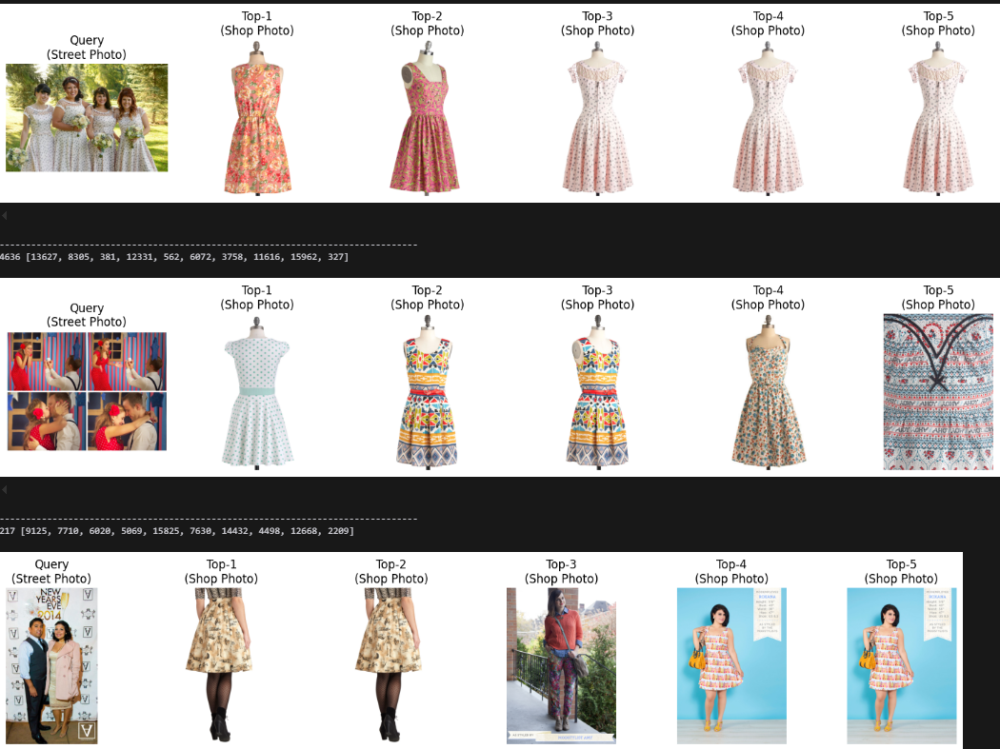
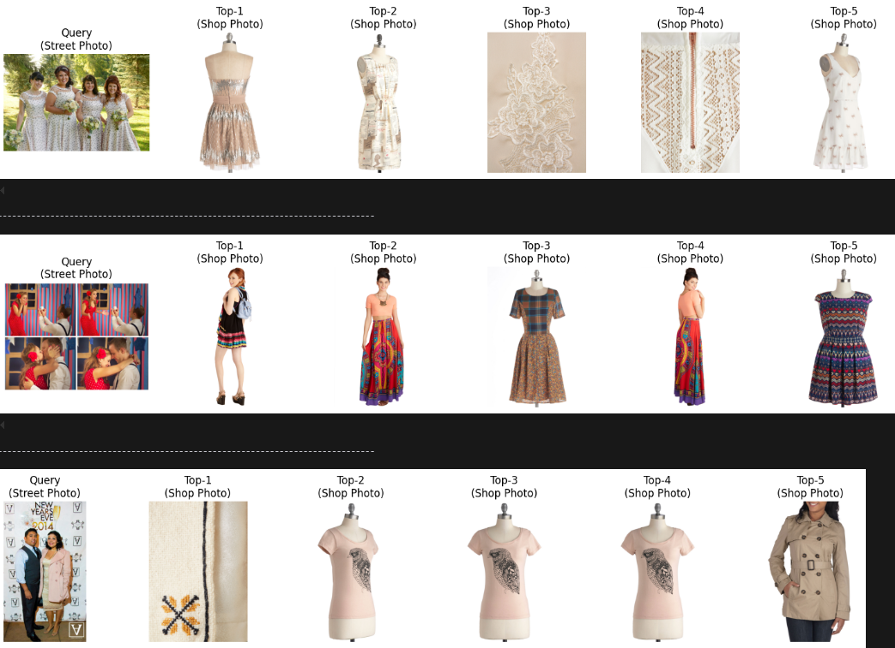
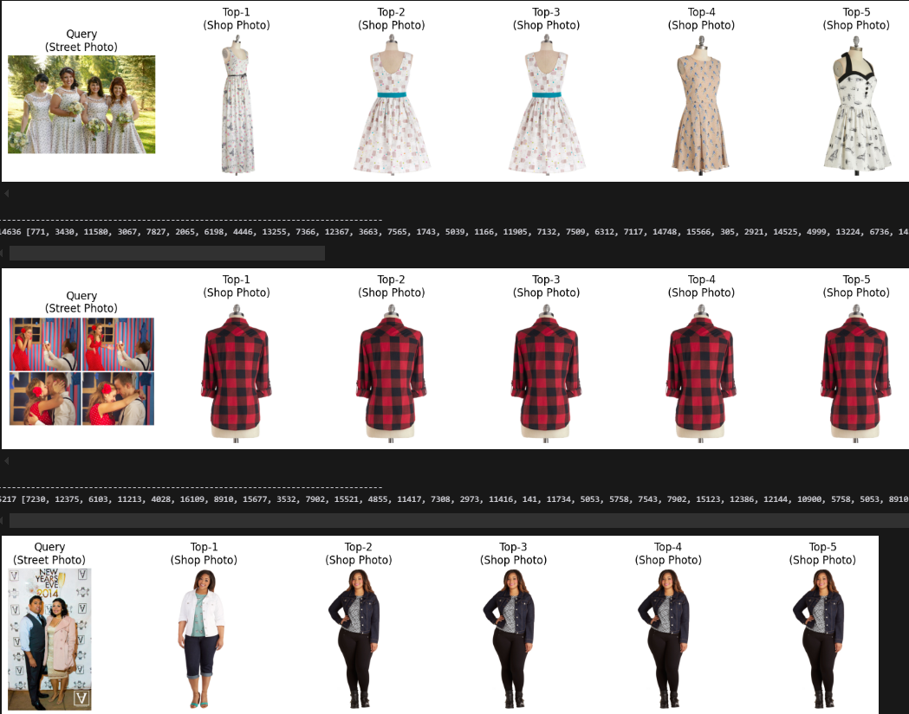
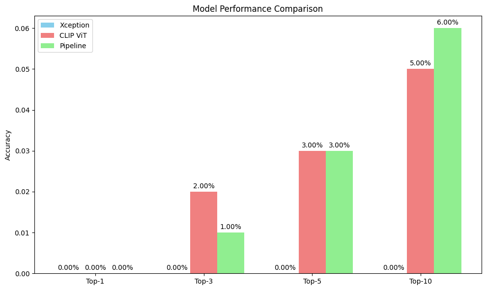

# Shopping Image Search

A deep learning-based image similarity search system that matches street photos with shop photos using the Street2Shop dataset. The system learns embeddings for both street and shop photos and uses FAISS for efficient similarity search.

## Overview

This project implements an image similarity search system for fashion items. Given a photo of clothing "in the wild" (street photo), it can find similar items from an online shopping catalog (shop photos). The system uses deep learning models to generate embeddings for images and FAISS for fast similarity search.

## Features

- Support for multiple deep learning architectures:
  - Xception network
  - CLIP ViT (Vision Transformer)
- Efficient similarity search using FAISS
- Data augmentation pipeline for both street and shop photos
- Training with contrastive learning using cosine embedding loss
- Evaluation metrics including top-k accuracy (k=1,3,5,10)
- GPU acceleration support
- Configurable dataset sampling ratio for experiments

## Installation
```bash
git clone https://github.com/petr7555/shopping-image-search.git
cd shopping-image-search
pip install -r requirements.txt
```

## Dataset

The project uses the Street2Shop dataset, which contains pairs of street photos and their matching shop photos. The dataset is automatically downloaded from Hugging Face's dataset hub.

Key dataset features:
- Automatic handling of corrupted images
- Data augmentation specific to street and shop photos
- Support for dataset sampling for quick experiments
- Stratified splitting for training/validation

## Project Structure
```
shopping-image-search/
├── dataset.py # Dataset classes and data loading utilities
├── train.py # Training loop and validation
├── models/
│ ├── base.py # Base model class
│ ├── xception.py # Xception model implementation
│ └── clip_vit.py # CLIP ViT model implementation
```

## Model Selection

### CLIP ViT Model

The CLIP ViT model is chosen for its powerful ability to learn visual representations that are aligned with textual descriptions. This model leverages a Vision Transformer (ViT) architecture, which processes images as sequences of patches, allowing it to capture detailed and contextual information effectively. CLIP ViT is particularly well-suited for fashion image retrieval due to its ability to understand and encode complex visual patterns and textures, making it an excellent choice for coarse retrieval tasks. Its pretraining on a diverse set of image-text pairs enables it to generalize well to various visual domains, enhancing the retrieval accuracy.

**Citation:**
- Radford, A., et al. (2021). [Learning Transferable Visual Models From Natural Language Supervision](https://arxiv.org/abs/2103.00020). In Proceedings of the International Conference on Machine Learning (ICML).

### BLIP-2 Model

BLIP-2 is integrated into the pipeline for its advanced capabilities in generating text captions from images, which significantly enhances query representation. Coupled with the MiniLM sentence transformer, it provides rich, descriptive text embeddings that complement image embeddings, facilitating a more comprehensive multi-modal retrieval process. This approach not only improves the accuracy of matching street photos with shop photos but also enriches the semantic understanding of the images, leading to better retrieval performance. BLIP-2's ability to bridge the gap between visual and textual data makes it a valuable addition to the pipeline.

**Citation:**
- Li, J., et al. (2022). [BLIP-2: Bootstrapping Language-Image Pre-training with Frozen Image Encoders and Large Language Models](https://arxiv.org/abs/2201.12086). In Proceedings of the Conference on Empirical Methods in Natural Language Processing (EMNLP).

### MobileViT Re-Ranker

MobileViT is employed as a re-ranking model to refine the final ranking of retrieved images. Its lightweight and efficient transformer-based architecture allows it to process images quickly while maintaining high accuracy. MobileViT enhances the retrieval pipeline by providing a detailed analysis of the candidate images, ensuring that the most relevant results are prioritized. This model is particularly useful in scenarios where computational resources are limited but high performance is required.

**Citation:**
- Mehta, S., et al. (2021). [MobileViT: Light-weight, General-purpose, and Mobile-friendly Vision Transformer](https://arxiv.org/abs/2110.02178). In Proceedings of the IEEE/CVF International Conference on Computer Vision (ICCV).

### YOLO Cropper

YOLOv8 is utilized for multi-crop detection, enabling the system to identify and extract multiple regions of interest from an image. This capability is crucial for fashion image retrieval, where different parts of an outfit may need to be analyzed separately. YOLO's real-time object detection performance ensures that the cropping process is both fast and accurate, providing high-quality inputs for subsequent stages of the retrieval pipeline.

**Citation:**
- Redmon, J., et al. (2016). [You Only Look Once: Unified, Real-Time Object Detection](https://arxiv.org/abs/1506.02640). In Proceedings of the IEEE Conference on Computer Vision and Pattern Recognition (CVPR).

## Training Details

- Uses contrastive learning with cosine embedding loss
- Implements early stopping based on validation loss
- Supports both CPU and GPU training
- Includes memory optimization for large datasets
- Uses data augmentation specific to street and shop photos:
  - Street photos: More aggressive augmentation (blur, affine transforms)
  - Shop photos: Lighter augmentation (color jitter, flips)

## Usage

### Training

```python
from models.xception import XceptionModel
from models.clip_vit import CLIPViTModel
from dataset import Street2ShopImageSimilarityDataset
from train import train

# Initialize dataset
dataset = Street2ShopImageSimilarityDataset(ratio=0.6) # Use 60% of data

# Choose a model
model = XceptionModel(embedding_dim=512)
# OR
model = CLIPViTModel(embedding_dim=512)

# Train the model
train(model, train_loader, optimizer, val_loader, device='cuda', save_dir='saved_models')
```

### Inference

```python
from dataset import Street2ShopImageSimilarityTestDataset

# Initialize test dataset with trained model
test_dataset = Street2ShopImageSimilarityTestDataset(model, ratio=0.6)

# Search similar items
street_photo = ...  # Load or provide the street photo
similar_indices = test_dataset.search(street_photo, k=5)
```

## Evaluation

### Evaluating Top-k Accuracies

To evaluate the model's performance using top-k accuracies, use the `evaluate_top_k_accuracies` function:

```python
from dataset import evaluate_top_k_accuracies

# Evaluate top-k accuracies
query_indices = ...  # List of indices to query
vis_indices = ...  # List of indices for visualization
accuracies, visualization_data = evaluate_top_k_accuracies(test_dataset, query_indices, vis_indices, k=10)

# Print accuracies
print("Top-1 Accuracy:", accuracies['top_1_accuracy'])
print("Top-3 Accuracy:", accuracies['top_3_accuracy'])
print("Top-5 Accuracy:", accuracies['top_5_accuracy'])
print("Top-10 Accuracy:", accuracies['top_10_accuracy'])
```

## Enhancements to Retrieval Performance

Inspired by Pinterest's image search pipeline, the following enhancements are implemented:

1. **Multi-Crop Detection (YOLOv8):** Detects multiple crops in an image to improve retrieval accuracy.
2. **Query Expansion (BLIP-2):** Generates text captions for images to enhance query representation.
3. **Multi-Modal Embeddings (CLIP ViT + MiniLM):** Combines embeddings from CLIP ViT for images and MiniLM for text to create a richer feature representation.
4. **Multi-Stage Retrieval (Coarse-to-Fine):** A retrieval pipeline that filters candidates using coarse similarity measures before fine-tuning with more detailed models.
5. **Re-Ranking (MobileViT):** Refines the final ranking of retrieved images using a MobileViT model.

### Pipeline Execution

The full pipeline is executed to perform a fashion search, leveraging the above enhancements to improve retrieval performance. The pipeline includes:
- **Image and Text Embedding Generation**: Using CLIP ViT for image embeddings and MiniLM for text captions.
- **FAISS Indexing and Search**: Efficiently retrieves top candidates using FAISS indices for both image and text embeddings.
- **Re-Ranking**: Combines image and text similarity scores to refine the final ranking of retrieved items using MobileViT.

## Results

The enhanced pipeline demonstrated improved retrieval performance, achieving higher top-k accuracy metrics compared to baseline models. The integration of multi-modal embeddings and re-ranking strategies significantly contributed to the system's ability to accurately match street photos with shop photos.

Sample retrieval results:

### Sample Results

| Model | Example Retrievals |
|-------|-------------------|
| Xception |  |
| CLIP ViT |  |
| Full Pipeline |  |

The following graph illustrates the performance comparison between different model configurations and retrieval strategies. The x-axis represents different top-k metrics (k=1,3,5,10), while the y-axis shows the accuracy percentage. The enhanced pipeline with multi-modal embeddings and re-ranking consistently outperforms the baseline CLIP ViT model across all metrics.



## Acknowledgments

- Street2Shop dataset
- CLIP model from OpenAI
- FAISS from Facebook Research
